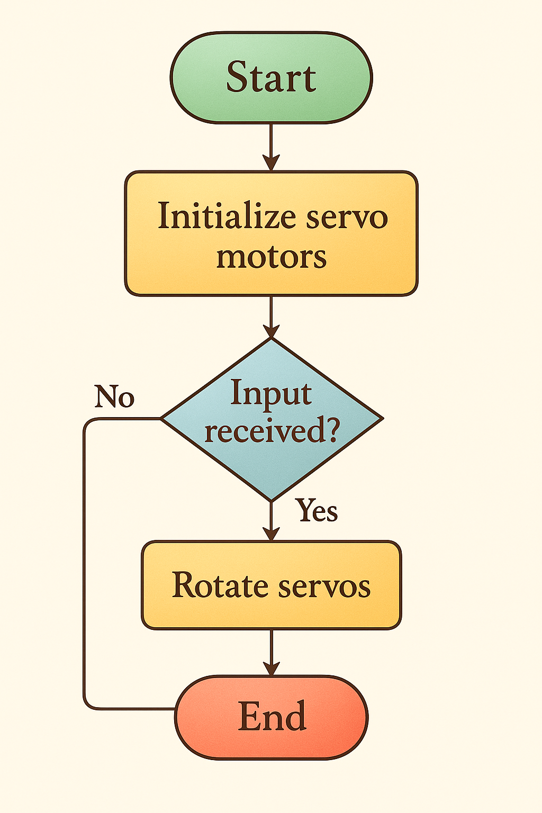
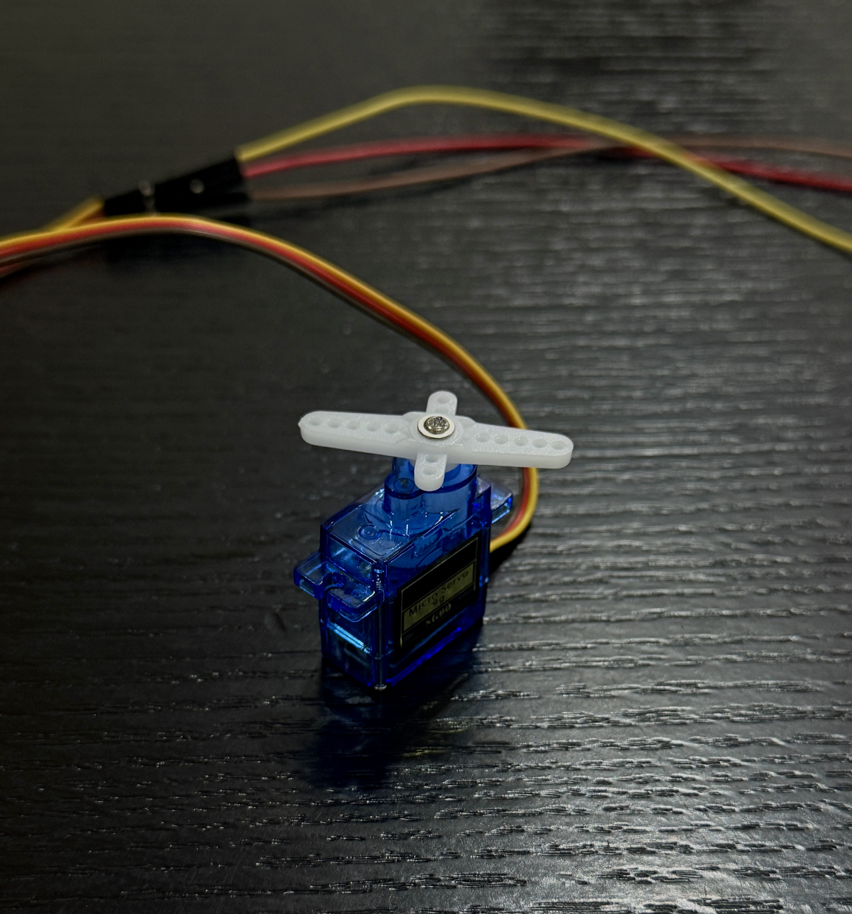
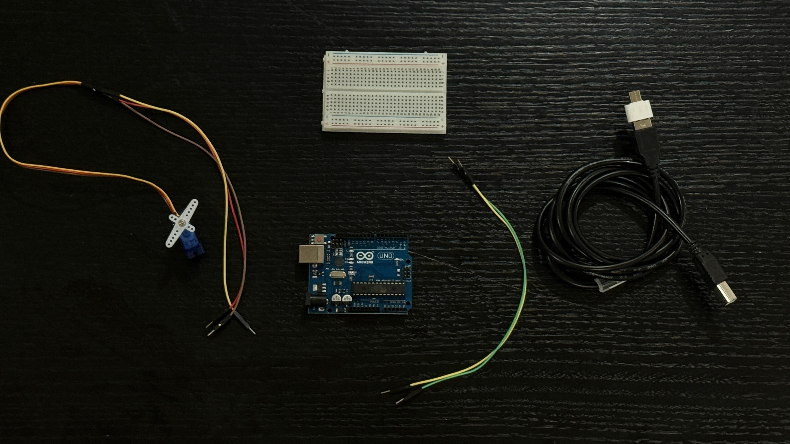

#  ServoMotor – Multi-Servo Control System with Arduino UNO 🤖 :


---

##   1. Project Overview :

An educational and hands-on project focused on controlling multiple servo motors with an Arduino UNO. It aims to simulate robotic movement, especially for humanoid robots, using servo motor rotation logic.


---

##   2. Components Used 🧩 :

| Component               | Quantity | Description                          |
|------------------------|----------|--------------------------------------|
| Arduino UNO            | 1        | Microcontroller board                |
| Breadboard             | 1        | For power and signal distribution    |
| TowerPro SG90 Servo    | 5        | 180° micro servos                    |
| Jumper Wires (M-M)     | 10+      | For signal & power connections       |
| External 5V Power (opt)| 1        | Optional for better torque           |

---

##  3. System Flowchart :

This flowchart describes the logical process of the servo motor control in the program.

###  Workflow Logic:
- Start the system  
- Initialize servo motors  
- Wait for input  
- If input is received → rotate all servos  
- End the loop or repeat




---

##  4. SG90 Servo Motor Details : 




The **TowerPro SG90 Micro Servo** is a lightweight, low-cost servo motor commonly used in robotics and motion-based DIY projects. It offers good torque and precision control through PWM signals, making it ideal for small robotic limbs and humanoid joints.

### 5. Specifications:

- **Operating Voltage:** 4.8V – 6.0V  
- **Stall Torque:** ~1.8 kg/cm  
- **Speed:** 0.1s/60° at 4.8V  
- **Control Method:** PWM  
- **Rotation Range:** 0° to 180°  
- **Weight:** ~9g  
- **Gear Type:** Plastic gears

[TowerPro SG90 Servo](Thecomponent.jpg)



### 6. Common Applications:

- Humanoid robots  
- Robotic arms & joints  
- RC planes and cars  
- Animatronics & toys

---

##  7. Arduino Code Overview :

```cpp
#include <Servo.h>

Servo servo1;
Servo servo2;
Servo servo3;
Servo servo4;
Servo servo5;

void setup()
{
  servo1.attach(3);
  servo2.attach(5);
  servo3.attach(6);
  servo4.attach(9);
  servo5.attach(10);
}

void loop()
{
  for (int i = 0; i <= 180; i += 10) {
    servo1.write(i); delay(50);
    servo2.write(i); delay(50);
    servo3.write(i); delay(50);
    servo4.write(i); delay(50);
    servo5.write(i); delay(50);
  }

  for (int i = 180; i >= 0; i -= 10) {
    servo1.write(i); delay(50);
    servo2.write(i); delay(50);
    servo3.write(i); delay(50);
    servo4.write(i); delay(50);
    servo5.write(i); delay(50);
  }

  /*
  // Optional test for individual servo
  for(int j = 0; j <= 180; j += 10) {
    servo2.write(j);
    delay(500);
  }

  for(int j = 180; j >= 0; j -= 10) {
    servo2.write(j);
    delay(500);
  }
  */
}
```
8. Project Structure 📂 :

```cpp
ServoMotor-Algorithm/
├── ServoMotor.ino          # Arduino code
├── ServoMotor.gif          # Real wiring image
├── flowchart.png           # Flowchart for algorithm
├── servo.jpg               # Real SG90 photo
└── README.md               # This file
```
